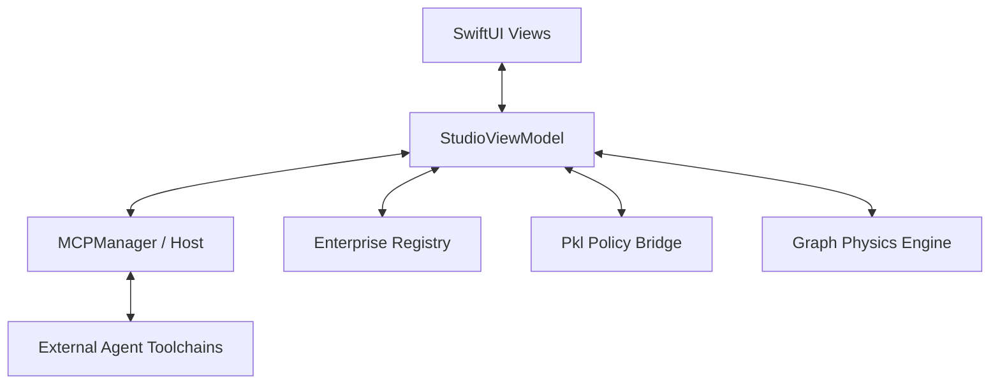

# Nibbleway Studio: Architecture & Implementation Guide

This document serves as your master blueprint for building **Nibbleway Studio**. Each section explains the "Why" and "How" of the system, providing you with the patterns to implement the code yourself.

---

## 1. The High-Level Architecture
Nibbleway Studio follows a modified **MVVM-E (Model-View-ViewModel-Engine)** pattern. We add the **Engine** layer to handle long-running, asynchronous processes like MCP orchestration and physics simulations.

### Key Components:
*   **View Layer (SwiftUI)**: High-density, cinematic layouts. Focus on `NavigationSplitView` and `Canvas` performance.
*   **ViewModel (Swift)**: The `@MainActor` coordinator. It manages the `@Published` state that drives the UI.
*   **MCP Host (`MCPManager`)**: The bridge to the world. It manages connections to local agents and exposes the `ArchitectContextServer`.
*   **Policy Engine (`PklBridge`)**: The "Rails." It validates the architectural state against organizational policies.

---

## 2. The Visualization Engine (Level 1-2)
You are building a custom **Force-Directed Graph**. This isn't just a static layout; it's a real-time simulation.

### The Physics Model:
1.  **Repulsion**: Every node pushes every other node away (Inverse Square Law).
2.  **Attraction (Springs)**: Linked nodes (Relationships) are pulled together based on a target length.
3.  **Damping**: We reduce velocity over time to let the graph "settle."

**Implementation Tip**: Use a `TimelineView` in SwiftUI to drive the 60fps refresh of your `Canvas`.

---

## 3. Advanced Orchestration (Level 2)
Your next goal is to expand the **Blueprint** beyond simple nodes. You need to handle **Level 2 (Containers)**.

### New Blueprint Schema:
| Field | Purpose |
| :--- | :--- |
| `endpoints` | Define URLs or API paths for a container. |
| `protocols` | Specify GraphQL, REST, gRPC (for policy validation). |
| `auth` | Document how systems talk to each other (OIDC, API Key). |

---

## 4. Policy Enforcement (The "Rails")
This is the core of Nibbleway's value. You will use **Pkl** to define what is "Safe."

### The Pattern:
1.  Architect defines a change in the YAML.
2.  `StudioViewModel` triggers `PklBridge`.
3.  Pkl evaluates the entire mesh.
4.  If a violation occurs (e.g., "Internal Database exposed to Public API"), the UI flags the node in **Red**.

---

## 5. Your First Exercise: Physics Integration
I have provided the `GraphSimulator.swift` as a reference. Your first task is to integrate it into your `ContentView`.

**Goal**: Make the nodes move on the screen when you update the YAML!
